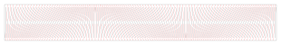

# Laser Cut Mobius Strip




Inspired by [Jeremy Baumberg's Moebius Strip on Obrary](https://obrary.com/products/moebius-strip), but I wanted to try to make the transitions between living hinge angles smoother.

## Installation / Usage

* First make sure you have docker installed
* Build and run the Jupyter notebook in it's container as follows:

``` /bin/bash
./start-docker.sh
```

* Then follow the link to the Jupyter notebook, and open the Mobius.ipynb file
* Adjust code as needed, then run to update mobius.svg
* Designed to be cut from 3mm MDF.
